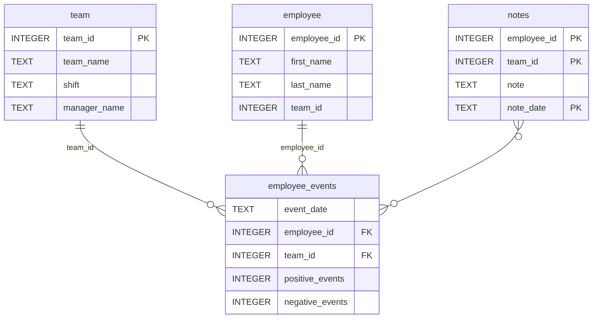

# Employee and Team Performance Dashboard

## Description
The Employee and Team Performance Dashboard is a FastHTML-powered web application that 
visualizes trends in positive and negative events, information about the events, and a 
prediction of the recruitment risk using a machine learning model. The dashboard connects 
to a SQL database and supports both team-level and individual-level analysis.

## Repository Structure
```
├── README.md
├── assets
│   ├── model.pkl
│   └── report.css
├── python-package
│   ├── employee_events
│   │   ├── __init__.py
│   │   ├── employee.py
│   │   ├── employee_events.db
│   │   ├── query_base.py
│   │   ├── sql_execution.py
│   │   └── team.py
│   ├── requirements.txt
│   ├── setup.py
├── report
│   ├── base_components
│   │   ├── __init__.py
│   │   ├── base_component.py
│   │   ├── data_table.py
│   │   ├── dropdown.py
│   │   ├── matplotlib_viz.py
│   │   └── radio.py
│   ├── combined_components
│   │   ├── __init__.py
│   │   ├── combined_component.py
│   │   └── form_group.py
│   ├── dashboard.py
│   └── utils.py
├── requirements.txt
├── tests
    └── test_employee_events.py
```

## Usage
1. Download or clone this repository.
2. Build the employee_events package.
	1. Navigate to the python-package directory within the repository.
	2. Run `python setup.py sdist`.
3. Install the necessary packages.
	1. Navigate to the root directory of the repository.
	2. Run `pip install -r requirements.txt`.
4. Start the web server.
	1. Navigate to the report directory within the repository.
	2. Run `python dashboard.py`.
5. View the dashboard by going to http://127.0.0.1:5001/ in a browser.

## Database (employee_events.db)



### Credits 

This project was built using starter code for Udacity's **Software Engineering for Data 
Scientists** course final project.
